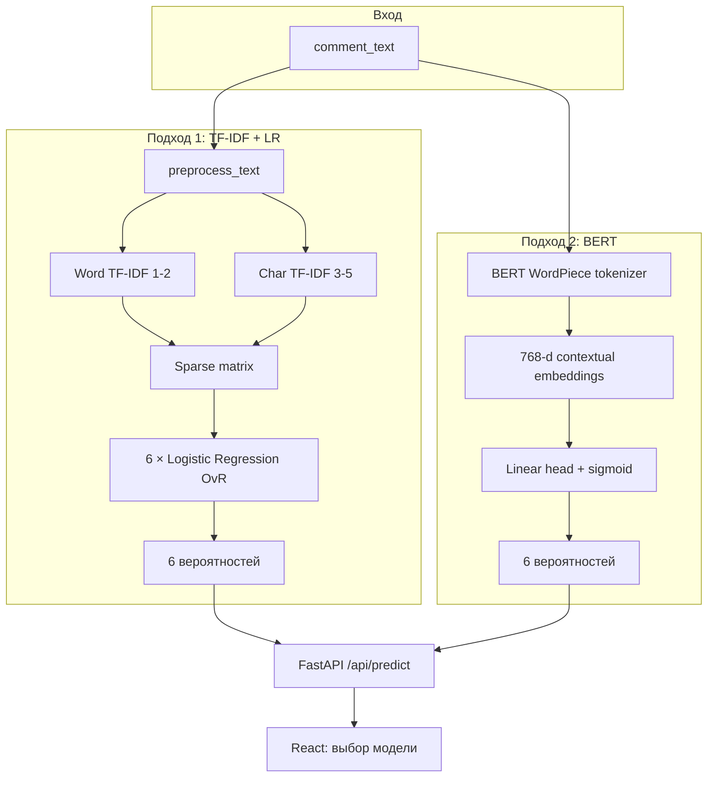

# NLP в Toxic Comment Detector: TF-IDF + LR и BERT

**Дата:** 2026-06-04  
**Датасет:** [Jigsaw Toxic Comment Classification Challenge](https://www.kaggle.com/c/jigsaw-toxic-comment-classification-challenge) (`data/raw/train.csv`)  
**Артефакты:** `models/model.pkl` (baseline), `models/bert/` (transformer)  
**Метрики:** `ml/experiments/baseline_tfidf_lr/metrics.json`, `ml/experiments/bert_multilabel/metrics.json`

---

## 1. Постановка задачи (NLP)

**Multi-label классификация** текста комментария: для каждого из шести бинарных признаков модель выдаёт вероятность \(P(y_i = 1 \mid \text{text})\). Один комментарий может одновременно иметь несколько меток (например, `toxic` + `insult` + `obscene`).

Фиксированный порядок меток (Jigsaw):

| # | Метка | Смысл (кратко) |
|---|--------|----------------|
| 1 | `toxic` | Общая токсичность |
| 2 | `severe_toxic` | Выраженная токсичность |
| 3 | `obscene` | Нецензурная лексика |
| 4 | `threat` | Угрозы |
| 5 | `insult` | Оскорбления |
| 6 | `identity_hate` | Враждебность к социальной группе |

Источник истины для порядка меток: `ml/labels.py` (используется в обучении, оценке и API).

---

## 2. Общая схема двух подходов



| Аспект | TF-IDF + LR | BERT |
|--------|-------------|------|
| Представление текста | Разреженные частотные n-gram | Контекстные эмбеддинги подслов (WordPiece) |
| Модель | Линейная (OvR) | Transformer encoder + линейная голова |
| Обучение | `sklearn` Pipeline, CPU | `transformers` Trainer, GPU опционально |
| Артефакт | `model.pkl` | `models/bert/` (HF format) |
| ID в API/UI | `tfidf_lr` | `bert` |

---

## 3. Подход 1: TF-IDF + Logistic Regression

Подробный отчёт: `ml/reports/01_tfidf_logistic_regression_baseline.md`.

### 3.1. Препроцессинг (`ml/preprocessing/text.py`)

Перед векторизацией применяется **лёгкая нормализация** (без лемматизации и стемминга):

1. HTML unescape (`&amp;` → `&`)
2. Lowercasing
3. Удаление URL и HTML-тегов
4. Схлопывание пробелов

Это снижает шум и дублирование признаков, сохраняя обфусцированные написания для char n-grams.

### 3.2. Признаки

**Word TF-IDF:** `analyzer="word"`, n-grams (1, 2), `max_features=100_000`, `sublinear_tf=True` — ловит лексику и короткие фразы («shut up»).

**Char TF-IDF:** `analyzer="char_wb"`, n-grams (3, 5) — устойчив к `1diot`, `id!ot`.

Оба потока объединяются через `FeatureUnion`.

### 3.3. Классификатор

`OneVsRestClassifier(LogisticRegression)` — шесть независимых бинарных LR с `class_weight="balanced"`. На инференсе: `predict_proba` → \(P(y=1)\) для каждой метки.

### 3.4. Обучение

```bash
python -m ml.training.train_baseline
```

Экспорт: `models/model.pkl`. Метрики: Hamming loss, macro/micro F1, per-label P/R/F1 (`ml/evaluation/metrics.py`).

---

## 4. Подход 2: BERT (multi-label)

### 4.1. Почему BERT для toxic detection

- **Контекст:** слово «kill» в «kill the lights» vs угроза — контекстные эмбеддинги учитывают окружение.
- **Синонимы и перефразирование:** не нужна точная совпадающая n-gram в обучающей выборке.
- **Перенос знаний:** `bert-base-uncased` предобучен на большом корпусе английского текста.

Компромиссы: больше памяти, медленнее инференс, нужны `torch` и `transformers`.

### 4.2. Архитектура

- Базовая модель: **`bert-base-uncased`** (12 слоёв, 768 hidden, WordPiece, max 512 токенов; в проекте **256** на инференсе/обучении для скорости).
- Голова: `AutoModelForSequenceClassification` с `problem_type="multi_label_classification"`, `num_labels=6`.
- Функция потерь (внутри HF): **BCEWithLogitsLoss** по всем меткам.
- Вероятности на выходе: **sigmoid** по каждому логиту (независимые метки).

Код сборки модели: `ml/training/bert_multilabel.py` → `build_bert_model()`.

### 4.3. Препроцессинг для BERT

Текст подаётся в **`AutoTokenizer`** почти **без** sklearn-препроцессинга: токенизатор сам режет на subwords, добавляет `[CLS]` / `[SEP]`, truncation/padding до `max_length`.

Для baseline TF-IDF препроцессинг остаётся обязательным; для BERT это осознанное различие пайплайнов (типичная практика для трансформеров).

### 4.4. Обучение

```bash
# Быстрая проверка на demo-корпусе (~10 примеров)
python -m ml.training.train_bert --demo --epochs 3

# Полный Jigsaw (долго; на CPU — субсэмпл)
python -m ml.training.train_bert --max-samples 5000 --epochs 1

# Полное обучение (рекомендуется GPU)
python -m ml.training.train_bert --epochs 2 --batch-size 16
```

Скрипт: `ml/training/train_bert.py`

- Загрузка данных: та же схема, что у baseline (`load_jigsaw_dataset` из `train_baseline.py`).
- Split: `train_test_split`, stratify по колонке `toxic`.
- `Trainer` (Hugging Face): AdamW, `learning_rate=2e-5`, `weight_decay=0.01`, eval каждую эпоху.
- Метрики hold-out: те же `multilabel_report`, порог по умолчанию **0.5**.
- Экспорт: `models/bert/` (`config.json`, веса, tokenizer, `labels.json` с порядком меток).

### 4.5. Инференс (backend)

`backend/app/services/bert_inference.py`:

1. Загрузка `AutoModelForSequenceClassification` и tokenizer из `BERT_MODEL_DIR`.
2. Токенизация одного комментария, `max_length` из `labels.json` (или 256).
3. Forward pass, sigmoid над logits → словарь `{label: probability}`.

---

## 5. API и интерфейс

### 5.1. Выбор модели

| Endpoint | Назначение |
|----------|------------|
| `GET /api/models` | Список моделей, описание, флаг `loaded` |
| `POST /api/predict` | Тело: `{ "text": "...", "model": "tfidf_lr" \| "bert" }` |
| `GET /api/ready` | Статус загрузки обеих моделей |

Реестр: `backend/app/services/registry.py` — при старте пытается загрузить оба артефакта; отсутствующий файл не падает, а помечается `loaded: false`.

Переменные окружения:

- `MODEL_PATH` — путь к `model.pkl`
- `BERT_MODEL_DIR` — каталог `models/bert`

### 5.2. Frontend

`frontend/src/App.tsx`: радиокнопки для `tfidf_lr` / `bert`, запрос `GET /api/models` при монтировании, в `POST /api/predict` передаётся поле `model`. Недоступные модели отображаются как «not loaded».

---

## 6. Сравнение подходов с точки зрения NLP

| Критерий | TF-IDF + LR | BERT |
|----------|-------------|------|
| Индуктивное смещение | Линейные комбинации n-gram | Нелинейные контекстные представления |
| OOV / редкие слова | Зависит от n-gram в train | Subword (WordPiece) |
| Обфускация (`id!ot`) | Char n-grams | Subwords + контекст |
| Ирония / negation | Слабо | Сильнее (но не гарантировано) |
| Скорость обучения | Минуты на CPU | Часы без GPU / минуты с GPU |
| Скорость инференса | Миллисекунды | Десятки–сотни мс на CPU |
| Интерпретируемость | Веса по n-gram | Низкая (attention не выводится в API) |

На hold-out Jigsaw baseline TF-IDF+LR даёт ориентир **F1 macro ≈ 0.62** (см. `baseline_tfidf_lr/metrics.json`). BERT после полноценного fine-tune обычно даёт **прирост macro-F1**, особенно на редких классах (`threat`, `identity_hate`), но точные цифры зависят от числа эпох, `max_samples` и железа — их нужно смотреть в `bert_multilabel/metrics.json` после вашего прогона.

---

## 7. Структура NLP-кода в репозитории

```text
ml/
├── labels.py                      # 6 меток Jigsaw
├── preprocessing/text.py          # Препроцессинг для TF-IDF
├── training/
│   ├── baseline_pipeline.py       # sklearn Pipeline
│   ├── train_baseline.py          # Обучение TF-IDF+LR
│   ├── bert_multilabel.py         # Dataset, sigmoid, save artifact
│   └── train_bert.py              # Fine-tune BERT
├── evaluation/metrics.py          # Multilabel метрики
└── reports/
    ├── 01_tfidf_logistic_regression_baseline.md
    └── 02_nlp_models_implementation.md   # этот документ

backend/app/services/
├── inference.py                   # sklearn predict_proba
├── bert_inference.py              # HF BERT predict
└── registry.py                    # маршрутизация по model id
```

---

## 8. Рекомендуемый порядок запуска

```bash
# 1. Зависимости ML (из корня репозитория)
pip install -r ml/requirements.txt

# 2. Baseline (если ещё нет model.pkl)
python -m ml.training.train_baseline

# 3. BERT (сначала demo, затем полный датасет)
python -m ml.training.train_bert --demo --epochs 3
# python -m ml.training.train_bert   # полный Jigsaw

# 4. Backend + frontend
pip install -r backend/requirements.txt
cd backend && python -m uvicorn app.main:app --reload --host 127.0.0.1 --port 8010
cd frontend && npm run dev
```

В UI выберите модель и отправьте комментарий — ответ содержит `probabilities` и поле `model`, подтверждающее использованный backend.

---

## 9. Возможные улучшения (NLP)

- **Единый препроцессинг-эксперимент** для BERT (лёгкая нормализация до tokenizer).
- Модели **`unitary/toxic-bert`** или **`roberta-base`** как альтернативный `--pretrained`.
- **Focal loss** / взвешивание редких классов для BERT.
- Калибровка вероятностей (temperature scaling) для сопоставимости порога 0.5 между моделями.
- Экспорт BERT в **ONNX** для ускорения CPU-инференса.

---

*Документ описывает реализацию двух NLP-пайплайнов в проекте toxic-comment-detector и их интеграцию в API/UI.*
